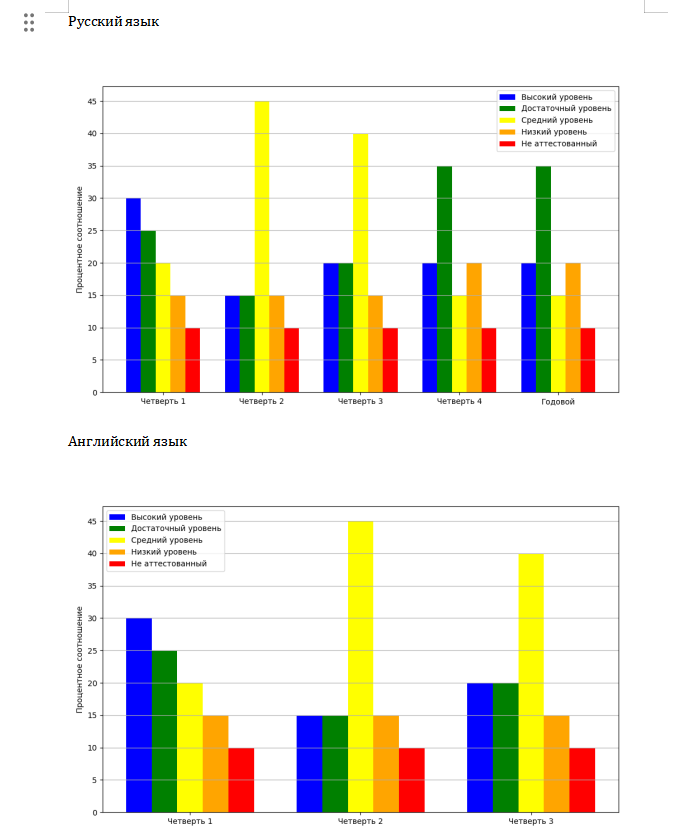

# ReportGenerator
## This is a script that generates a report on students' academic performance according to the following parameters: high, sufficient, average, low, not certified (values ​​in percentages).

# How to use:
## 1. Edit the `config.yaml` file
```yaml
legend:
  highLevel: "blue" # высокий уровень (цвет)
  sufficientLevel: "green" # достаточный уровень (цвет)
  intermediateLevel: "yellow" 
  lowLevel: "orange" # низкий уровень (цвет)
  notCertified: "red" # не аттестованный (цвет)
subjects:
  - name: "Русский язык"
    periods:
      - name: "Четверть 1"
        highLevel: 6 # высокий уровень (количество)
        sufficientLevel: 5 # достаточный уровень (количество)
        intermediateLevel: 4 # средний уровень (количество)
        lowLevel: 3 # низкий уровень (количество)
        notCertified: 2 # не аттестованный (количество)
        total: 20 # общее количество
      - name: "Четверть 2"
        highLevel: 3
        sufficientLevel: 3
        intermediateLevel: 9
        lowLevel: 3
        notCertified: 2
        total: 20
  - name: "Английский язык"
    periods:
      - name: "Четверть 1"
        highLevel: 6
        sufficientLevel: 5
        intermediateLevel: 4 
        lowLevel: 3
        notCertified: 2
        total: 20
      - name: "Четверть 2"
        highLevel: 3
        sufficientLevel: 3
        intermediateLevel: 9
        lowLevel: 3
        notCertified: 2
        total: 20
  - name: "Математика"
    periods:
      - name: "Четверть 1"
        highLevel: 6
        sufficientLevel: 5
        intermediateLevel: 4
        lowLevel: 3
        notCertified: 2
        total: 20
      - name: "Четверть 2"
        highLevel: 3
        sufficientLevel: 3
        intermediateLevel: 9
        lowLevel: 3
        notCertified: 2
        total: 20
  - name: "История"
    periods:
      - name: "Четверть 1"
        highLevel: 6
        sufficientLevel: 5
        intermediateLevel: 4
        lowLevel: 3
        notCertified: 2
        total: 20
      - name: "Четверть 2"
        highLevel: 3
        sufficientLevel: 3
        intermediateLevel: 9
        lowLevel: 3
        notCertified: 2
        total: 20
```

## 2. Install the necessary dependencies
```
git clone https://github.com/hikimory/ReportGenerator.git
cd ReportGenerator
pip install -r requirements.txt
```

## 3. Run the file
```
python report_generator.py
```

## Report example
